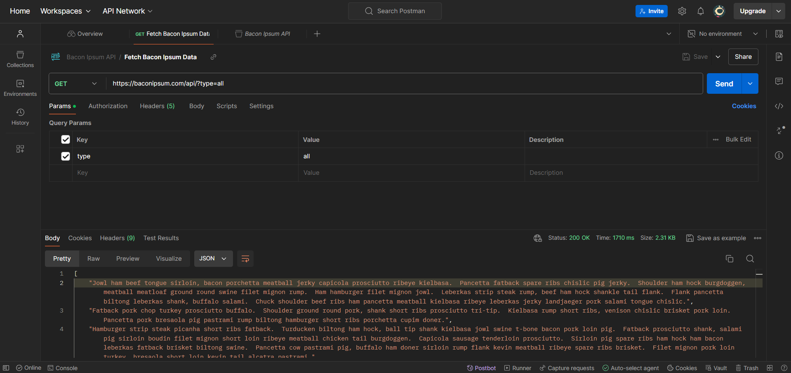

# Bacon Ipsum API - Postman Collection

This Postman Collection includes a simple GET request to fetch data from the Bacon Ipsum API.

## How to Import the Postman Collection

Follow the steps below to import the Postman Collection into your Postman workspace:

1. Open Postman and go to the "Collections" tab on the left sidebar.
2. Click on the "Import" button located at the top left corner.
3. In the Import dialog, choose the "Upload Files" option.
4. Select the provided Postman Collection file 
5. Click "Open" to import the collection.
6. The collection will now appear under the "Collections" tab in Postman.

## Environment Variables and Configurations

This GET request does not require any environment variables or additional configurations.

## API Endpoint

The API endpoint used in this collection is:

[
    "Jowl ham beef tongue sirloin, bacon porchetta meatball jerky capicola prosciutto ribeye kielbasa.  Pancetta fatback spare ribs chislic pig jerky.  Shoulder ham hock burgdoggen, meatball meatloaf ground round swine filet mignon rump.  Ham hamburger filet mignon jowl.  Leberkas strip steak rump, beef ham hock shankle tail flank.  Flank pancetta biltong leberkas shank, buffalo salami.  Chuck shoulder beef ribs ham pancetta meatball kielbasa ribeye leberkas jerky landjaeger pork salami tongue chislic.",
    "Fatback pork chop turkey prosciutto buffalo.  Shoulder ground round pork, shank short ribs prosciutto tri-tip.  Kielbasa rump short ribs, venison chislic brisket pork loin.  Pancetta pork bresaola pig pastrami rump biltong hamburger short ribs porchetta cupim doner.",
    "Hamburger strip steak picanha short ribs fatback.  Turducken biltong ham hock, ball tip shank kielbasa jowl swine t-bone bacon pork loin pig.  Fatback prosciutto shank, salami pig sirloin boudin filet mignon short loin ribeye meatball chicken tail burgdoggen.  Capicola sausage tenderloin prosciutto.  Sirloin pig spare ribs ham hock ham bacon leberkas fatback brisket biltong swine.  Pancetta cow pastrami pig, buffalo ham doner sirloin rump flank kevin meatball ribeye spare ribs brisket.  Filet mignon pork loin turkey, bresaola short loin kevin tail alcatra pastrami.",
    "Chuck drumstick doner jerky leberkas andouille.  Jerky shank ribeye, pork chop bresaola drumstick meatball sirloin.  Pig cow buffalo burgdoggen, pork belly porchetta kevin turkey shoulder pastrami pork loin fatback.  Tenderloin biltong shank capicola turkey burgdoggen rump drumstick pancetta filet mignon hamburger chuck jerky flank shoulder.",
    "Beef tri-tip tail brisket turducken beef ribs spare ribs swine shankle prosciutto landjaeger rump cupim drumstick.  Ball tip cupim buffalo, ham hock pastrami landjaeger t-bone ribeye pork belly jowl chislic ham.  Shank ham meatball turkey, chislic prosciutto doner swine sausage t-bone andouille alcatra.  Ball tip fatback kevin tri-tip jerky spare ribs salami chicken ham."
]